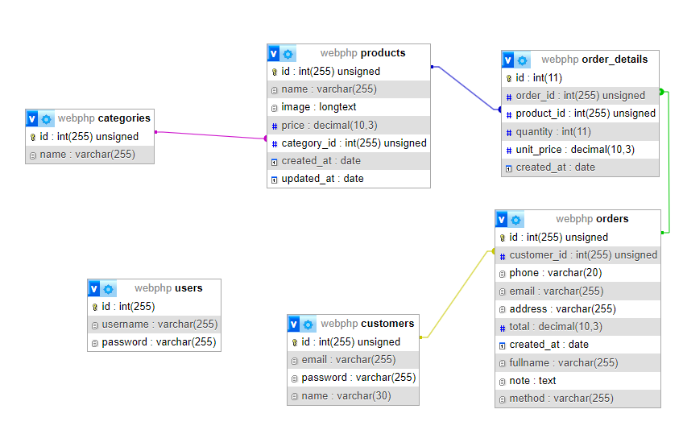

# ClothesForBoy - Men's Clothing E-commerce Website

## Introduction
ClothesForBoy is an e-commerce website specializing in men's clothing. The website provides features such as user login, ordering, and product management, with a user-friendly and easy-to-use interface.

## Database Design

## Technologies Used
- HTML/CSS/JS/PHP: Frontend development.
- PHP: Backend logic.
- MySQL: Database management.
- JWT (JSON Web Tokens): Authentication and session management.

## Features
1. **User Authentication and Account Management:**
   - Users can log in as customers or administrators.
   - Administrators use JWT for logging into the management dashboard.

2. **Order Placement:**
   - Customers can place orders after logging in or as guests.
   - Order information is stored in the database and email notifications are sent to customers.

## Dashboard Page
- **Link:** [Dashboard Page](https://clothesforboy.000webhostapp.com/index.php?controller=login)
- **User:** admin
- **Password:** 123456

## Home Page
- **Link:** [Home Page](https://clothesforboy.000webhostapp.com/index.php?controller=home)

## Installation Guide
1. Clone the repository from the Github link.
2. Configure the `config.php` file to connect to the MySQL database.
3. Run the SQL file to create database tables and sample data if needed.
4. Access the home page and start using the website.

## Future Development
- Implement search and product filtering features.
- Optimize the website for faster page loading.
- Integrate online payment functionality.

## Contributor
- Name: Tram
- Email: tram20012001@gmail.com

## License
[License information, e.g., MIT License]
